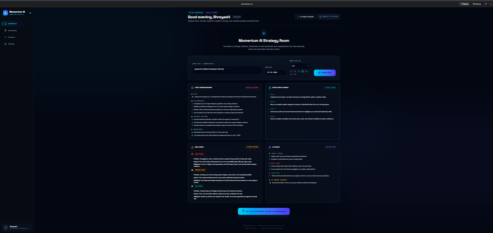
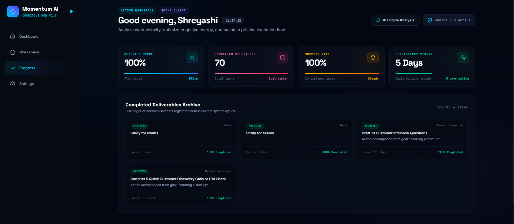
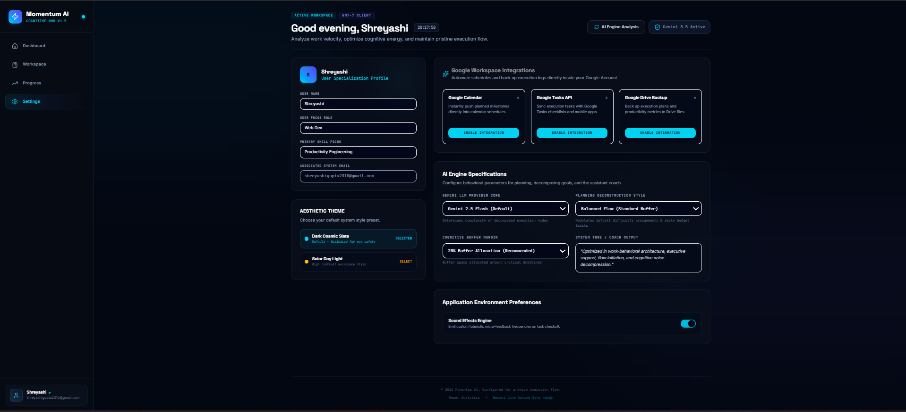

# Momentum AI

An AI-powered execution workspace that transforms high-level goals into structured execution plans, helping users focus on doing instead of planning.


## Problem

Many students, developers, and professionals know **what** they want to achieve but struggle with **how** to break large goals into actionable steps.

Most productivity tools are task managers—not execution assistants.

Momentum AI bridges this gap by using Gemini to convert goals into structured execution workflows.

---

##  Solution

Momentum AI analyzes a user's objective, deadline, and available working hours to generate an intelligent execution roadmap.

Instead of simply storing tasks, it provides:

- Goal understanding
- Step-by-step execution plans
- Risk analysis
- AI coaching
- Actionable milestones

---

##  Features

-  AI Goal Analysis
-  Automatic Task Breakdown
-  Risk Assessment
-  AI Coach Recommendations
-  Interactive Workspace
-  Progress Tracking
-  Futuristic Dark UI

---

##  Tech Stack

Frontend
- React
- TypeScript
- Vite

Backend
- Express

Styling
- CSS

AI
- Gemini API

---

##  Google Technologies Used

- Google AI Studio
- Gemini API
- Cloud Run Deployment

---

##  Run Locally

```bash
npm install
```

Create an `.env.local`

```env
GEMINI_API_KEY=YOUR_API_KEY
```

Run

```bash
npm run dev
```

---

##  Screenshots

Dashboard

<p align="center">
  
</p>

Workspace

<p align="center">
  
</p>

Progress
<p align="center">
  
</p>


Settings

<p align="center">
  
</p>
---


## Future Improvements

- Google Calendar Integration
- Gmail Integration
- Voice-based Planning
- Team Collaboration
- Mobile Application

---

## 👩‍💻 Built By

**Shreyashi Gupta**

Built using Google AI Studio + Gemini during the hackathon.